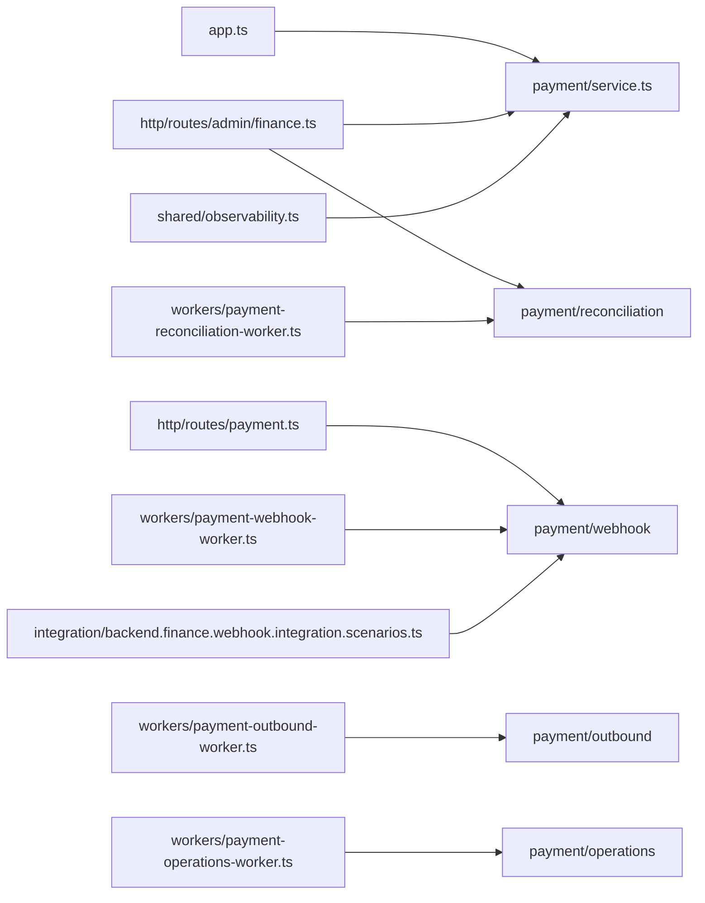
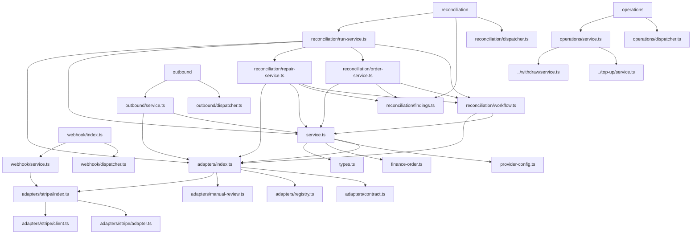

# Payment Module

## Scope

The payment module owns payment provider routing, finance state transitions,
review metadata, webhook/reconciliation helpers, and the persistence shape for
deposits, withdrawals, payout methods, and provider events.

## Source Of Truth

- Shared status enums and cross-app record models: `apps/shared-types/src/finance.ts`
- Database schema: `apps/database/src/modules/finance/index.ts`
- Routing and provider capability decisions: `service.ts`
- Provider adapters and provider-specific implementations: `adapters/`
- Webhook intake/verification/dispatch: `webhook/`
- Reconciliation orchestration, findings, and repair flows: `reconciliation/`
- Outbound provider order submission worker flow: `outbound/`
- Timeout cleanup and compensation cycles: `operations/`
- Review/state helpers: `finance-order.ts`, `state-machine.ts`
- User-facing money movement entrypoints: `../top-up/service.ts`,
  `../withdraw/service.ts`, `../bank-card/service.ts`

## Public API

- `service.ts`
  - Provider discovery and capability overview
  - Payment routing and processing context selection
  - Shared finance review metadata helpers
- `adapters/`
  - Adapter contract, registry, manual-review adapter, and Stripe adapter
- `webhook/`
  - Webhook dispatcher and webhook event intake / verification
- `reconciliation/`
  - Reconciliation dispatcher, finding model, run loop, and auto-repair flow
- `outbound/`
  - Provider outbound request dispatcher and submission flow
- `operations/`
  - Timeout cleanup and compensation cycle dispatcher

## Public Dependency Map

## Internal Dependency Map

## Boundary Audit

- External consumers currently import payment code only through:
  `service.ts`, `adapters/`, `webhook/`, `reconciliation/`, `outbound/`,
  and `operations/`.
- The active source tree under `apps/backend/src`, `apps/admin/src`,
  `apps/frontend`, `apps/mobile`, and `packages` does not import internal
  implementation paths such as `payment/webhook/service`,
  `payment/reconciliation/run-service`, or `payment/outbound/service`
  directly.
- Audit scope excludes historical scratch copies under `.claude/worktrees/`.

## Review Notes

- New finance statuses or review actions must land in
  `apps/shared-types/src/finance.ts` first, then flow into the database and
  services from there.
- Keep compiled output out of `src/`; generated artifacts belong in `dist/`
  only.
- Do not reintroduce parallel finance table definitions outside
  `apps/database/src/modules/finance/`.
